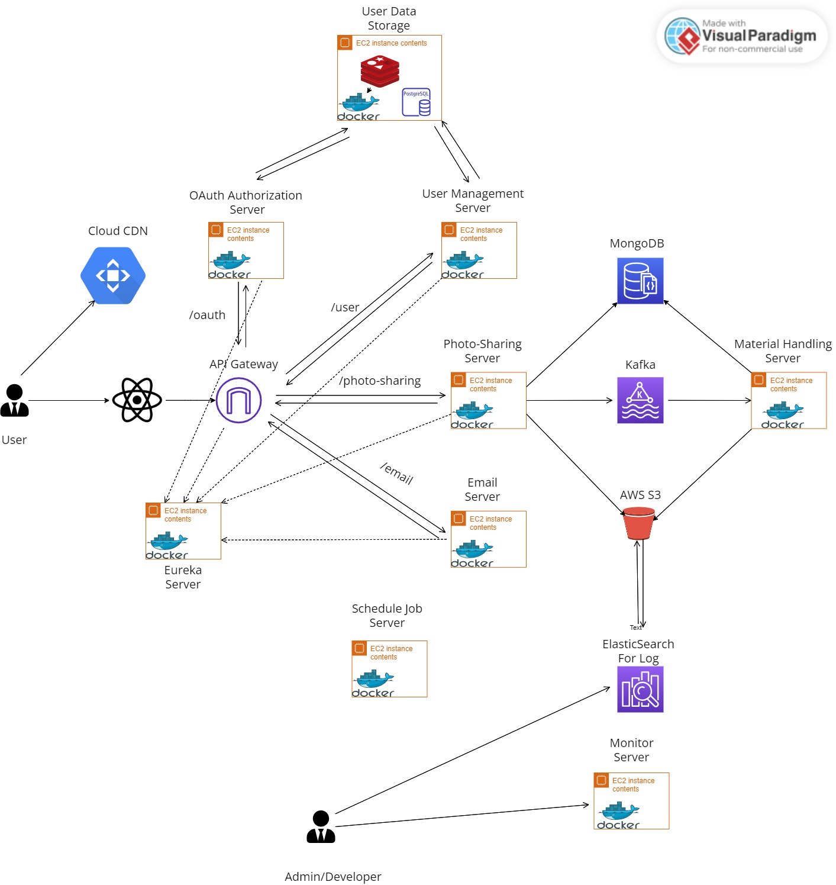

# final_project
I want to build the whole base component for most web applicaiton, not only the function component, but also including
CI/CD component, like jenkins server, gitlab. but it depends on how much I can do beacuse there is not enough time for
me to implement the whole picture.
### Architecture

### Tech Stack

| Name           | Website                                  |
|----------------|------------------------------------------|
| Java           | [https://www.java.com/](https://www.java.com/)             |
| Spring         | [https://spring.io/](https://spring.io/)                     |
| Python         | [https://www.python.org/](https://www.python.org/)           |
| Golang         | [https://go.dev/](https://go.dev/)                           |
| OAuth          | [https://oauth.net/2/](https://oauth.net/2/)                 |
| Kafka          | [https://kafka.apache.org/](https://kafka.apache.org/)       |
| Hibernate      | [https://hibernate.org/](https://hibernate.org/)             |
| Django         | [https://www.djangoproject.com/](https://www.djangoproject.com/) |
| Gin            | [https://gin-gonic.com/](https://gin-gonic.com/)             |
| GORM           | [https://gorm.io/](https://gorm.io/)                         |
| Material-UI    | [https://mui.com/](https://mui.com/)                         |
| React Router   | [https://react.dev/](https://react.dev/)                     |
| PostgreSQL     | [https://www.postgresql.org/](https://www.postgresql.org/)   |
| Redis          | [https://redis.io/](https://redis.io/)                       |
| MongoDB        | [https://www.mongodb.com/](https://www.mongodb.com/)         |
| AWS            | [https://docs.aws.amazon.com/index.html](https://docs.aws.amazon.com/index.html) |
| Jenkins        | [https://www.jenkins.io/](https://www.jenkins.io/)           |
| GitHub         | [https://github.com/](https://github.com/)                   |
| Maven          | [https://maven.apache.org/](https://maven.apache.org/)       |
| Docker         | [https://www.docker.com/](https://www.docker.com/)           |
| Kubernetes     | [https://kubernetes.io/](https://kubernetes.io/)             |
| Prometheus     | [https://prometheus.io/](https://prometheus.io/)             |
| Grafana        | [https://grafana.com/](https://grafana.com/)                 |
| ElasticSearch  | [https://www.elastic.co/](https://www.elastic.co/)           |

### TimeTable

| Week         | Task                                                  | Delivery                       |
|--------------|-------------------------------------------------------|--------------------------------|
| Week 0       | Research                                              | Project Description            |
| Week 1       | Build base architecture and Integrate OAuth 2.0        |                                |
| Week 2       | Integrate Spring Security, PostgreSQL, Redis, and Hibernate | Preliminary Report        |
| Week 3       | Integrate Docker and K8S, deploy all components to AWS EC2 as docker image |                                |
| Week 4       | Develop a Role-based permission function and build CI/CD pipeline environment (Jenkins) |                                |
| Week 5       | Build log collection platform and ElasticSearch, Learn Scrum |                                |
| Week 6       | Build Monitor System, develop collect metrics from Reusable Component, and write Interim Report | Interim Report         |
| Week 7       | Learn ReactJs and develop Front UI                     |                                |
| Week 8       | Learn ReactJs and develop Front UI                     |                                |
| Week 9       | Learn ReactJs, develop Front UI, and finalize Report Template | Final Report Template   |
| Week 10      | Develop Photo-Sharing System                           |                                |
| Week 11      | Develop Photo-Sharing System                           |                                |
| Week 12      | Develop Photo-Sharing System and write Final Report     | Final Report and Code          |
| Week 13      | Viva                                                  |                                |

Please note that the table formatting may vary depending on the Markdown renderer you are using.
